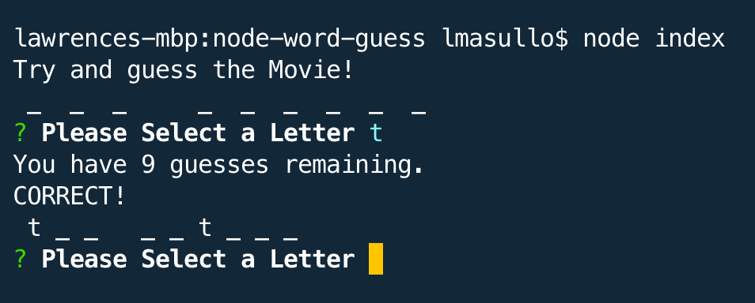

# Project Title

**Node Word Guess**

## Description:

Love movies? Try you best to guess the random movie.

### Installing

* Clone this repository
* Run npm init -y
* Run npm install

## Built With

* Javascript
* Node.js

The app uses the following NPM packages: 

### NPM Packages

* Inquirer - provides the menu system

## Instructions

* Start the program by running 'node index.js' in the terminal
* You will be presented with this menu:

* Type a letter and the app will tell you if you are correct. If you guess correctly, the letter will replace the underscore.
* You get 10 choices, good luck!

## Demo (Click the Image to View the Demo Video)

## GitHub Repo
https://github.com/lmasullo/node-word-guess

## Versioning

We use [SemVer](http://semver.org/) for versioning. 
Current version is 1.0

## Authors

**Larry Masullo (sole author)**

## Portfolio
https://www.masullodev.com

## License

This project is licensed under the MIT License - see the [LICENSE.md](LICENSE.md) file for details

## Acknowledgments

Thanks to the Instructors and Teaching Assistants in the UT Full Stack Coding Bootcamp for their support. 
