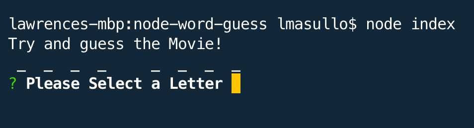

# Project Title

**Node Word Guess**

## Description:

Love movies? Try you best to guess the random movie.

### Installing

* Clone this repository
* Run npm init -y
* Run npm install

## Built With

* Javascript
* Node.js

The app uses the following NPM packages: 

### NPM Packages

* Inquirer - provides the menu system

## Instructions

* Start the program by running 'node index.js' in the terminal
* You will be presented with this menu:

* Use your arrow key to make a choice and press 'Enter'
* You will be given a confirmation message, press 'Enter' if you want to continue
* Enter the Search Term and press 'Enter'
* You will be presented with the search results:

* You have your choice to search for a concert, song, or a movie.
* The last choice in the menu "Run Text File Command' will read the random.txt file and execute the enclosed command.
* All of the search results are saved in the log.txt file

## Demo (Click the Image to View the Demo Video)

## GitHub Repo
https://github.com/lmasullo/liri-node-app

## Versioning

We use [SemVer](http://semver.org/) for versioning. 
Current version is 1.0

## Authors

**Larry Masullo (sole author)**

## Portfolio
https://www.masullodev.com

## License

This project is licensed under the MIT License - see the [LICENSE.md](LICENSE.md) file for details

## Acknowledgments

Thanks to the Instructors and Teaching Assistants in the UT Full Stack Coding Bootcamp for their support. 
